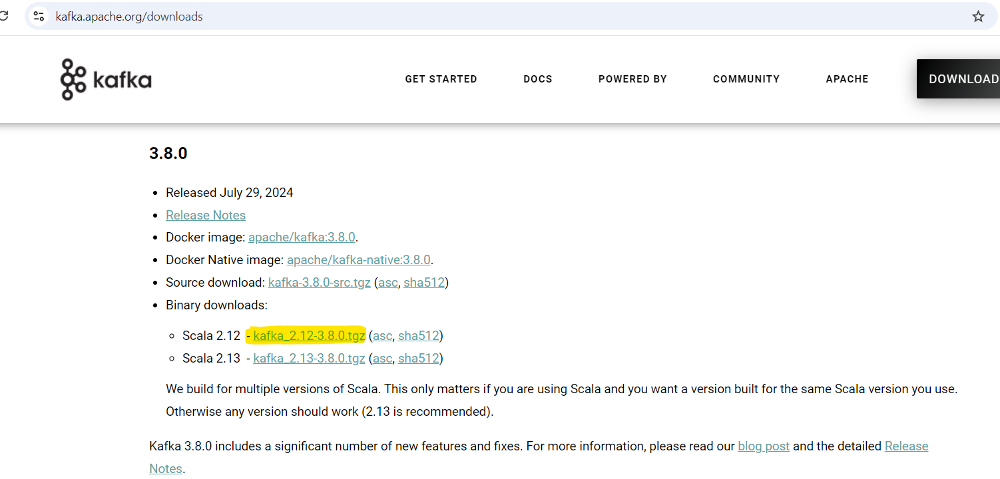
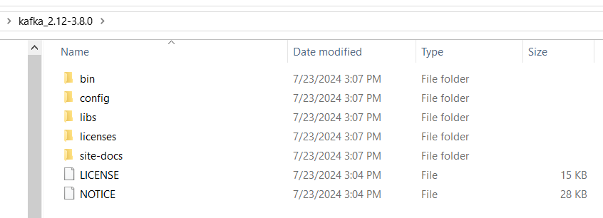
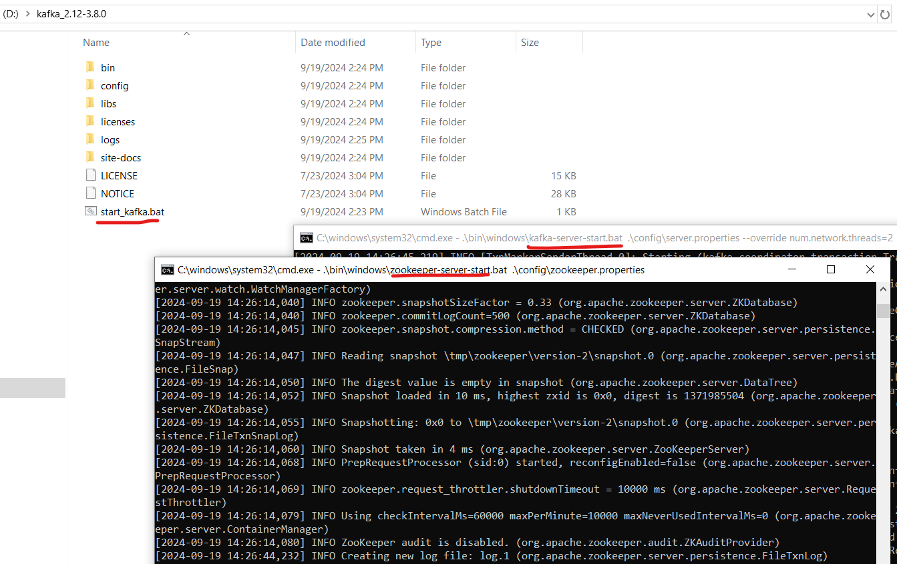

# Guideline to run the Kafka server on a Windows local machine and demonstrate the produce and consume messages

## Auto steps
- Run the `./docker-compose.yaml` file to start the Zookeeper server, Kafka server and Kafka UI tool once.

## Manually steps
### Step 1: Download the latest Kafka Tar File
- Go directly to the Apache Kafka website: https://kafka.apache.org/downloads
    
- Unzip and open the tar file
    
    - bin: This is where the shell scripts are. These are the scripts that we will run to get Kafka to run.
    - config: This is where properties files are that we can modify to change the parameters of various functions in Kafka.
    - libs: This is where we find the libraries and jar files that are used to get Kafka to run smoothly.
    - licenses: This folder just contains the licenses that Kafka is registered under.

### Step 2: Start the Zookeeper Server
- Run following this command: `start cmd /k ".\kafka_2.12-3.8.0\bin\windows\zookeeper-server-start.bat .\kafka_2.12-3.8.0\config\zookeeper.properties"`

### Step 3: Start the Kafka Server
- Run following this command: `start cmd /k ".\kafka_2.12-3.8.0\bin\windows\kafka-server-start.bat .\kafka_2.12-3.8.0\config\server.properties --override num.network.threads=2"`

### Another way to quickly start the Zookeeper Server and the Kafka Server
- Copy the `./start_kafka.bat` file and paste it into the `.\kafka_2.12-3.8.0` folder which is unzipped folder.
- Double-click on the `start_kafka.bat` file in the `.\kafka_2.12-3.8.0` folder.
    

### Understand the purpose of the elements of Kafka
- Run Zookeeper: This is how Kafka keeps track of the metadata that is had. It will run on port 2181.
- Run the Kafka Server: This will run the kafka server which will host any interactions between the producer and consumer. This will run on port 9092.

### Kafka (Kafbat) UI is a free, open-source web UI to monitor and manage Apache Kafka clusters
- https://github.com/kafbat/kafka-ui/blob/main/documentation/compose/DOCKER_COMPOSE.md
- Or https://github.com/provectus/kafka-ui